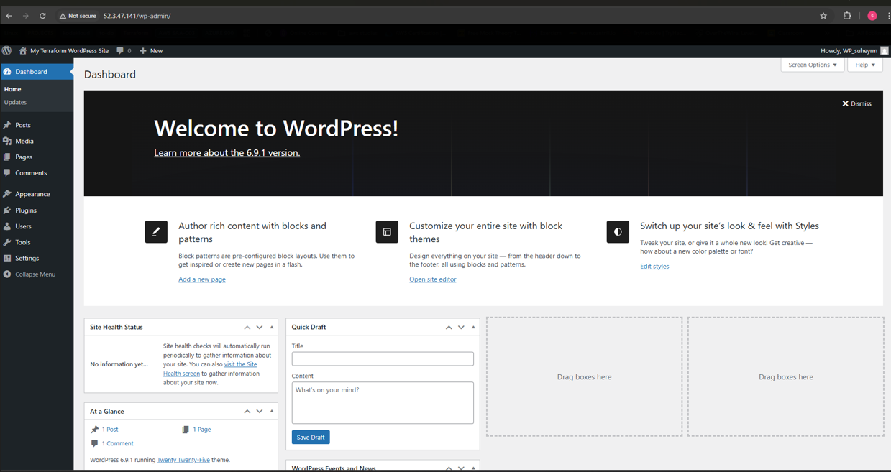

# 🚀 WordPress Deployment on AWS using Terraform


This project provisions a fully functional WordPress environment on AWS using **Infrastructure as Code (Terraform)**.

The deployment includes:

- An EC2 instance running Apache & PHP  
- An RDS MySQL database  
- Secure networking using properly configured Security Groups  
- Elastic IP for stable public access  

---

## 🏗 Architecture Overview

**AWS Resources Used:**

- EC2 (t3.micro – Free Tier eligible)
- RDS MySQL (db.t3.micro – Free Tier eligible)
- Elastic IP
- Security Groups
- Default VPC
- Terraform for infrastructure provisioning

This architecture separates the application layer (EC2) from the database layer (RDS) following AWS best practices.

---

## 🛠 Tools & Technologies

- Terraform  
- AWS EC2  
- AWS RDS  
- Apache  
- PHP  
- MySQL  
- WordPress  
- Amazon Linux 2023  

---

## ⚙️ Deployment Instructions

### 1️⃣ Clone the Repository

```bash
git clone https://github.com/SuheyrM/Wordpress-TF-AWS
cd Wordpress-TF-AWS

Configure Required Variables

Before deployment, configure:

EC2 Key Pair name
SSH CIDR (your public IP in /32 format)
RDS database password
You can supply variables using:
terraform.tfvars
Environment variables
CLI -var flags

Initialize Terraform
terraform init

Deploy Infrastructure
terraform apply
After deployment completes, Terraform will output the public IP address.

Access WordPress
http://<EC2_PUBLIC_IP>/wp-admin
Complete the WordPress installation through the browser interface.

Live Deployment
http://52.3.47.141
Note: HTTP only — HTTPS was not configured as this project was built within AWS Free Tier constraints.

Proof of Successful Deployment




Security Configuration

SSH restricted to personal IP address only
RDS database is not publicly accessible
RDS allows traffic only from the EC2 security group
No open database ports exposed to the internet
Principle of least privilege applied

Challenges Faced & Resolved

Debugged “Error Establishing Database Connection”
Fixed RDS credential mismatches
Corrected security group misconfigurations
Managed Terraform state inconsistencies
Rebuilt infrastructure cleanly using terraform destroy
Resolved RDS password reset issues

Key Concepts Learned

Infrastructure as Code (IaC)
Terraform resource lifecycle management
AWS networking fundamentals
EC2 ↔ RDS connectivity troubleshooting
Debugging real-world deployment issues
Cloud cost awareness (Free Tier usage)

Future Improvements

Add custom domain (Route 53)
Configure HTTPS with Certbot
Use Application Load Balancer (ALB)
Implement Auto Scaling
Store secrets in AWS Secrets Manager
Add CI/CD integration
Remote Terraform state using S3 backend

Cleanup

terraform destroy

Project Purpose

This project was built as part of hands-on AWS and Terraform learning to demonstrate:
Cloud infrastructure automation
Secure production-style deployment
Infrastructure debugging and recovery

Cost-aware cloud engineering practices
